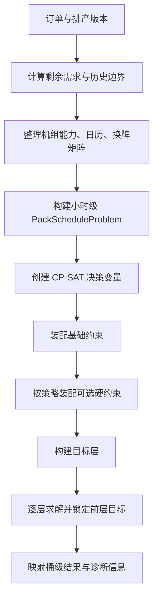

# 卷包产品级 CP-SAT 智能排产建模说明（当前实现版）

> 本文依据当前 `factory-production` 中的卷包 CP-SAT 源码整理，重点说明模型实际创建的变量、约束、目标和求解链路。本文只描述 CP-SAT，不把 GA、MILP 或早期按天建模方案混入当前模型。源码发生变化时，应以代码和本文同步更新为准。

## 1. 为什么要建设 APS

### 1.1 卷包排产本质上是资源约束下的时间决策

卷包生产计划不是简单地把订单按先后顺序排列，而是要同时回答以下问题：

- 哪一张订单由哪一台机组生产；
- 哪个时间段开哪几台机组；
- 每个时间段生产哪个牌号、生产多少；
- 订单是否能在交期前完成；
- 牌号切换需要预留多少有效生产时间；
- 上月尾段、历史续排和本期新排如何衔接；
- 设备开停、齐开齐停、无间隙和最大开台数等现场要求如何同时满足。

这些决策相互影响。例如，把订单分到更多机组可以提前完成，但可能增加换牌和协调成本；为了减少换牌而集中在少数机组，又可能导致交期风险。APS 的价值，就是把订单、设备、日历、能力、换牌和业务规则放进同一个可计算的计划模型中，在可行性和多个业务目标之间进行统一权衡。

### 1.2 传统人工排产的主要问题

人工排产通常依赖经验、表格和多轮沟通，容易出现以下问题：

1. 资源、订单和日历数据分散，难以及时发现需求与能力不匹配。
2. 小时级设备空档、尾量、换牌时间和交期边界难以在表格中精确表达。
3. 一项规则的调整可能破坏另一项规则，例如无间隙与换牌时间、齐开齐停与不同设备能力之间的冲突。
4. 排产结果缺少可复现的约束依据，发生无解或延期时难以说明原因。
5. 当订单、机组或日历发生变化时，重新排产成本高，计划难以滚动调整。

APS 并不是替代生产管理人员，而是将人工经验转化为可配置规则，把大量组合计算交给优化器，让计划人员把精力放在规则确认、异常处理和结果审核上。

### 1.3 APS 与周边系统的职责边界

| 系统或环节 | 主要职责 | CP-SAT 在其中的作用 |
| --- | --- | --- |
| ERP／计划系统 | 提供订单、计划量、交期和业务主数据 | 接收待排需求和订单边界 |
| APS | 在资源和规则约束下计算可执行计划 | 计算订单—机组—时间桶—数量安排 |
| MES／生产执行 | 执行、反馈实际生产和设备状态 | 为下一轮排产提供已排量、历史边界和实际状态 |
| 设备与日历系统 | 提供机组能力、班次、可用窗口和停机信息 | 形成可排时间桶和能力上界 |
| 计划人员 | 确认规则、审核结果、处理异常和业务取舍 | 配置硬约束、目标优先级并解释结果 |

当前模型的边界是“计划期内卷包产品的资源分配与时间安排”。它不负责生成订单、不替代现场执行、不自动修正错误主数据，也不保证模型之外的现场规则天然得到满足。

## 2. 当前模型范围与总体流程

### 2.1 模型范围

当前 CP-SAT 模型以排产订单明细为需求对象，以机组为生产资源，以全局连续时间轴上的小时级时间桶为离散时间单位。模型同时处理：

- 订单明细级剩余需求、交期和牌号归属；
- 机组—牌号能力矩阵和速度等级；
- 机组开台日历、有效工时和历史续排边界；
- 方向性牌号换牌时间；
- 可选的交期、连续、无间隙、齐开齐停、首段衔接等硬约束；
- 可配置的欠产、完工时间、换牌、高速机、前置空闲和机组牌号优先目标。

### 2.2 求解主链路



对应实现入口为 `PackScheduleCpSatService`。正式排产大体遵循：

1. `PackScheduleProblemBuilder` 将数据库对象归一化为 CP-SAT 标准输入。
2. `PackScheduleVariableBuilder` 创建稀疏决策变量，只为有日历且有正产能的组合建变量。
3. `PackScheduleCpSatService` 按基础规则和策略配置选择 ConstraintBuilder。
4. `PackScheduleObjectiveBuilder` 将有效目标按优先级组织为目标层。
5. 每层单独求解；当前层目标值锁定后，继续求解下一层。
6. `PackScheduleSolutionMapper` 读取解并转换为业务排产明细、指标和诊断信息。

## 3. 标准化输入与时间模型

### 3.1 标准化输入

`PackScheduleProblem` 是求解器与业务数据之间的边界对象，主要包含：

| 输入 | 主要内容 | 用途 |
| --- | --- | --- |
| `products` | 订单计划明细、牌号、待排量、交期 | 形成需求对象和 `q` 变量 |
| `lines` | 机组、速度等级 | 形成资源集合和速度目标 |
| `buckets` | 小时级时间桶、开始／结束时间、工作日 | 形成全局时间轴 |
| `capacityByKey` | 订单明细—机组—时间桶的整数产能上界 | 限制 `q` 的最大值 |
| `availableByKey` | 机组—时间桶是否可用 | 决定是否可以建机组开机变量 |
| `workHoursByKey` | 机组—时间桶的有效工时 | 支持能力分配和换牌有效时间轴 |
| `changeoverTimes` | 方向性换牌分钟数 | 约束生产块顺序与间隔 |
| 历史边界 | 上月末牌号、续排首个可排桶 | 支持上月衔接和续排贴边 |
| 策略配置 | 硬约束开关、目标、优先级和权重 | 决定模型实际装配内容 |

### 3.2 小时时间桶

当前模型不是“每天一个时间槽”，而是将计划期时间轴按每天最早可用时刻到最晚可用时刻切成小时级桶。通常一个桶为一小时，计划窗口末尾不足一小时的部分保留为尾桶。

每个 `PackScheduleBucket` 至少包含：

- 从 0 开始的全局桶序号 `index`；
- `bucketStartTime` 和 `bucketEndTime`；
- 所属自然工作日 `workDay`；
- 桶的自然时长 `workHours`。

机组日历与桶窗口取交集后，再按有效工时从窗口起点向后分配。停机、休息和窗口末尾未使用的损耗不被当作连续有效生产时间；换牌模型使用机组自己的有效工时轴计算块间空闲。

### 3.3 需求和产能的整数口径

CP-SAT 使用整数变量：

- 待排需求必须是整数箱；小数需求会在构题阶段拒绝；
- 日能力按整箱口径向上取整；
- 日能力再按桶有效工时比例分配到小时桶，保持该日分配总量；
- 每个 `q[p,l,t]` 为非负整数，单位为箱。

因此，模型不是连续工时模型。短生产段、换牌时间和不足一小时尾桶都会受到小时离散粒度影响。

### 3.4 变量只在可排组合上创建

如果某个机组—时间桶没有可用日历，或指定订单在该机组—时间桶的整数产能不大于 0，则不创建对应的订单生产变量。该组合在模型中相当于固定为不可生产，而不是先建变量再用大量约束置零。

## 4. 决策变量

设：

- $p$：订单计划明细；
- $l$：机组；
- $t$：全局小时桶；
- $C_{p,l,t}$：订单 $p$ 在机组 $l$、桶 $t$ 的产能上界；
- $D_p$：订单 $p$ 的待排需求；
- $A_{p,l,t}$：订单 $p$、机组 $l$、桶 $t$ 是否是可排组合。

| 变量 | 类型 | 含义 |
| --- | --- | --- |
| `x_{p,l,t}` | Bool | 订单 $p$ 是否在该机组该桶有正产量 |
| `u_{l,t}` | Bool | 机组 $l$ 在该桶是否实际生产 |
| `q_{p,l,t}` | Int | 订单 $p$ 在该机组该桶的生产箱数 |
| `start[p,l,t]` | Bool | 订单在机组上的生产块是否从该桶开始 |
| `end[p,l,t]` | Bool | 订单在机组上的生产块是否在该桶结束 |
| `productLineUsed[p,l]` | Bool | 订单是否使用该机组 |
| `operatorname{unfulfilled}_p` | Int | 订单欠产量 |
| `lineUsed[l]` | Bool | 机组在整个计划期内是否被使用 |
| `leadingIdle[l,t]` | Bool | 机组在真正开工前的前置空闲桶标识 |
| `lineCompletion[l]` | Int | 机组最后一个生产桶的结束分钟偏移 |
| `makespan` | Int | 所有机组中最晚完工时间 |
| `生产块变量` | Bool／Int | 生产块使用、前序、首尾桶、前序牌号、换牌分钟等 |
| `同步变量` | Bool／Int | 同步成员、使用台数、同步开工／停机桶 |

表中数学变量统一使用行内 $...$ 表示；源码变量名、配置字段和类名统一使用反引号表示。

`PackScheduleVariableBuilder` 负责创建变量和上下界；业务语义由后续 Builder 绑定，不在变量创建阶段偷偷实现业务规则。

## 5. 基础硬约束

基础硬约束不依赖策略目标，构建正式模型时始终存在。

### 5.1 单机单桶单订单与开机绑定

同一机组、同一时间桶最多生产一个订单明细：

$$
\begin{aligned}
\sum_{p} x_{p,l,t} &\le 1,\\
\sum_{p} x_{p,l,t} &= u_{l,t}.
\end{aligned}
$$

业务含义：一台机组在一个小时桶内不能同时生产两张订单；只要某张订单在该桶有正产量，机组就被视为实际开机。没有任何可排订单的桶不能被误判为开机。

实现：`AssignmentConstraintBuilder`。

### 5.2 产能上下界和正产量绑定

$$
\begin{aligned}
q_{p,l,t} &\le C_{p,l,t}\,x_{p,l,t},\\
q_{p,l,t} &\ge x_{p,l,t},\\
q_{p,l,t} &\ge 0.
\end{aligned}
$$

当 `x=0` 时，产量必须为 0；当 `x=1` 时，产量至少为 1 箱且不超过该桶能力。这样可以避免用“零产量的假生产”制造虚假的连续块或同步状态。

实现：`CapacityConstraintBuilder`。

### 5.3 需求平衡与欠产

每张订单都建立需求守恒：

$$
\begin{aligned}
\sum_{l}\sum_{t} q_{p,l,t}+\operatorname{unfulfilled}_{p} &= D_{p},\\
0\le \operatorname{unfulfilled}_{p} &\le D_{p}.
\end{aligned}
$$

当策略启用“必须满足需求”时，再增加：

$$
\operatorname{unfulfilled}_{p}=0
$$

未启用时，模型允许在资源不足或规则冲突时保留欠产，并由“欠产最小化”目标决定尽量完成多少。启用必须完成后，资源不足可能直接导致无解。

同一牌号的多张订单按构题阶段确定的交期、计划明细 ID 顺序处理。后序订单开始生产前，前序订单必须已经完成全部需求：

$$
\operatorname{afterStart}_{p_2,l,t}
\Rightarrow
\sum_{l'}\sum_{t'\le t}q_{p_1,l',t'}\ge D_{p_1}
$$

这是订单级先后约束，不等同于仅按牌号汇总后排序。

实现：`DemandConstraintBuilder`。

### 5.4 生产块的起止结构

在机组可用桶序列上：

$$
\begin{aligned}
\operatorname{start}_{p,l,t} &= x_{p,l,t}\land \neg x_{p,l,t^-},\\
\operatorname{end}_{p,l,t} &= x_{p,l,t}\land \neg x_{p,l,t^+}.
\end{aligned}
$$

这里的 $t^-$ 和 $t^+$ 分别表示该机组有效可用桶序列中的前一桶和后一桶。序列边界没有前一桶或后一桶时，直接由当前生产变量决定开始或结束。不可用桶不参与扫描；可用但没有该订单产能的桶按不生产处理，因此会切断该订单的连续块。

基础结构还绑定 `productLineUsed[p,l]`：

$$
\operatorname{productLineUsed}_{p,l}=1
\Longleftrightarrow
\sum_{t}x_{p,l,t}\ge 1
$$

实现：`ProductionStructureConstraintBuilder`。

### 5.5 单机单订单最多一个连续生产块

$$
\sum_{t}\operatorname{end}_{p,l,t}\le 1
$$

业务含义：同一订单在同一机组上不能生产一段、停下来、再回来生产第二段。它约束的是“订单明细—机组”，不是同一牌号在全厂只能形成一个生产段。

实现：`ContinuityConstraintBuilder`。

## 6. 可选硬约束

下面的 Builder 由策略中的硬约束配置决定。配置键为空时，正式排产不会装配对应规则；可行性诊断可能以不同严格程度单独装配阶段模型。

### 6.1 最大同时开台数

对每个时间桶限制实际生产机组数：

$$
\sum_{l}u_{l,t}\le \operatorname{MaxOpen}_{t}
$$
这里统计的是生产开机变量 `u`。换牌结构本身不单独增加一个开机变量，因此“最大同时开台数”不等于换牌资源数量限制。

实现：`MaxSimultaneousMachinesConstraintBuilder`。

### 6.2 交期约束

每张订单拥有 `dueBucketIndex`，表示交期边界对应的最晚允许桶。

严格完成模式，即同时启用交期和必须完成需求时：

$$
\sum_{l}\sum_{t\le \operatorname{dueBucket}_{p}}q_{p,l,t}\ge D_{p}
$$

允许欠产模式，即启用交期但未启用必须完成需求时：

$$
q_{p,l,t}=0,\qquad
t>\operatorname{dueBucket}_{p}
$$

因此允许欠产并不表示可以在交期后继续补产；交期后产量会被禁止，未完成部分保留为欠产。没有明确时间的日期交期由构题阶段映射到当天边界。

实现：`DueDateConstraintBuilder`。

### 6.3 上月末牌号作为本月首段

启用 `matMonthContinue` 后，对有上月末段牌号的机组：

1. 检查该牌号在本期是否存在可排订单；
2. 检查该机组在首个可排桶是否有该牌号能力；
3. 要求该机组本期实际使用上月末牌号；
4. 要求该牌号是该机组本期第一次生产的牌号。

这不是“整月只能生产上月牌号”，而是“如果该机组本期参与生产，本期首段必须先衔接上月尾段”。如果必要能力缺失，代码会在构建阶段报告连续性失败，不能靠完全不使用该机组绕过适用条件。

实现：`MatMonthContinueConstraintBuilder`。

### 6.4 续排首段贴边

启用 `append_start_continuity` 后，只对存在历史续排边界的机组生效：

$$
\operatorname{appendLineUsed}_{l}=1
\Rightarrow
u_{l,\operatorname{firstAppendBucket}_{l}}=1
$$

如果该机组本轮没有被使用，不触发贴边；没有历史边界的普通新排机组也不受该规则影响。

实现：`AppendStartContinuityConstraintBuilder`。

### 6.5 首桶开工

启用 `first_bucket_start_control` 后：

$$
\operatorname{lineUsed}_{l}=1
\Rightarrow
u_{l,\operatorname{firstSchedulableBucket}_{l}}=1
$$

它约束的是机组整个计划期的第一个可排桶，不是每天的第一个桶。该规则允许机组完全不使用，但一旦使用就不能跳过本期首个可排桶。

实现：`FirstBucketStartConstraintBuilder`。

### 6.6 机组生产无间隙

启用 `no_gap_between_blocks` 后，在每台机组的有效生产桶序列上统计 0→1 的启动次数：

$$
\sum_{t}\operatorname{blockStart}_{l,t}\le 1
$$

允许机组晚开始并持续生产，也允许最终结束；禁止“生产—空闲—再次生产”。休息日或没有 `u` 变量的无效桶被跳过，所以自然日不连续不一定会被视为生产间隙。

该规则约束整台机组的生产状态，而不是牌号块。机组持续生产期间可以切换订单，但若换牌需要有效空闲时间，可能与无间隙规则共同导致无解。

实现：`NoGapBetweenBlocksConstraintBuilder`。

### 6.7 未完成前不允许切走当前物料

启用 `forbidReturnToFinishedMaterial` 后，若机组在当前桶之后仍有该订单的正产能，则该订单在当前桶结束时必须已经在全局完成：

$$
\operatorname{end}_{p,l,t}\land \operatorname{hasFutureCapacity}_{p,l,t}
\Rightarrow
\operatorname{producedThrough}_{p,t}=D_{p}
$$

其中：

$$
\operatorname{producedThrough}_{p,t}
=\sum_{l'}\sum_{t'\le t}q_{p,l',t'}
$$

业务含义是：不要让一台仍然具备生产能力的机组先切走，之后再回头生产同一物料。若该机组后续已经没有该物料能力，则允许它自然结束并退出。

实现：`ForbidReturnToFinishedMaterialConstraintBuilder`。

### 6.8 前满后尾

启用 `full_bucket_before_tail` 后，同一订单—机组生产块只有最后一个桶允许不满：

$$
q_{p,l,t}+C_{p,l,t}\,\operatorname{end}_{p,l,t}
\ge C_{p,l,t}\,x_{p,l,t}
$$

当当前桶生产且不是尾桶时，`end=0`，因此 `q=C`；当当前桶是尾桶时，允许 `q<C`。它减少连续生产中的中间碎片，但会受小时桶粒度和需求尾量影响。

实现：`FullBucketBeforeTailConstraintBuilder`。

### 6.9 牌号计划量优先

启用 `brandPlanQtyPriority` 后，代码按订单待排量升序或降序建立相邻计划量的全局开工顺序。对前后两个计划量不同的订单：

$$
\operatorname{start}_{\mathrm{after},l,t}
\Rightarrow
\operatorname{startedBy}_{\mathrm{before},t}
$$

`startedBy[before,t]` 表示前置订单在当前桶或更早桶已经在任意机组开工。该约束只要求前置订单先开工，不要求前置订单完成后后置订单才能开始；相同计划量的订单不建立该关系。

实现：`BrandPlanQtyPriorityConstraintBuilder`。代码还记录假设变量和相邻配对诊断，以便在不可行时定位冲突。

### 6.10 齐开齐停

启用 `syncMachineCount` 后，对每张订单从实际使用机组中选择同步成员：

$$
\begin{aligned}
\operatorname{syncMember}_{p,l}
&\le \operatorname{productLineUsed}_{p,l},\\
\sum_{l}\operatorname{syncMember}_{p,l}
&=\min\!\left(
\sum_{l}\operatorname{productLineUsed}_{p,l},
\operatorname{syncMachineCount}
\right).
\end{aligned}
$$

选中的同步成员共享全局桶编号的开始桶；默认 `START_STOP` 模式还共享结束桶：

$$
\begin{aligned}
\operatorname{syncMember}_{p,l}=1
&\Rightarrow
\operatorname{startBucket}_{p,l}=\operatorname{groupStartBucket}_{p},\\
\operatorname{syncMember}_{p,l}=1
&\Rightarrow
\operatorname{endBucket}_{p,l}=\operatorname{groupEndBucket}_{p}.
\end{aligned}
$$

配置同步台数不是“必须至少使用这么多台机组”。如果实际使用台数不足，实际使用的机组都可能成为同步成员；如果超过配置数，只选择配置数量的成员。没有共同可行开工桶或完工桶的机组对会被提前互斥。

同步采用全局桶编号，不能把每台机组的本地第一个桶直接理解成相同的实际时刻；同步也只保证桶边界一致，不保证桶内的精确分钟级开停一致。

实现：`SynchronizedStartStopConstraintBuilder`。

## 7. 换牌与生产块结构

### 7.1 什么时候装配换产模型

正式模型满足以下任一条件时装配 `ChangeoverConstraintBuilder`：

- 显式启用 `changeover_structure_control` 硬约束；
- 配置 `changeover_control` 目标；
- 配置 `restart_gap_control` 目标。

因此，“换牌目标”并不只是改变解的排序；它会把生产块顺序、换牌窗口和首桶产能占用结构引入模型。

### 7.2 生产块节点和顺序

模型把每个“订单明细—机组”的连续生产块视为节点，用带虚拟起点和终点的 Circuit 约束确定块的先后顺序：

- 未使用的块走自环；
- 使用的块必须进入生产块序列；
- 块之间建立前后弧；
- 前块结束时间不得晚于后块开始时间。

同一牌号的不同订单可以直接衔接，不计为真实换牌；只有前后块的物料／牌号不同，才设置 `materialChange` 事件。

### 7.3 方向性换牌时间

前牌号到后牌号的换牌时间按方向查表：

$$
\operatorname{requiredMinutes}
=\operatorname{changeoverTime}_{\mathrm{previousMaterial},\mathrm{targetMaterial}}
$$

甲→乙与乙→甲可以不同；缺失、为空或非正数的时间按当前代码的兜底行为处理。换牌前后关系由弧决定，不是简单地给每个订单固定扣除一个换牌小时数。

### 7.4 有效工时窗口

正式换产模型中，块间有效空闲分钟必须满足方向性换牌时间：

$$
\begin{aligned}
\operatorname{idleMinutes}
&=\operatorname{targetStartTime}-\operatorname{predecessorEndTime},\\
\operatorname{idleMinutes}
&\ge \operatorname{requiredMinutes}.
\end{aligned}
$$

有效时间轴只累计机组可用于生产的有效工时，停机、休息和不可用时间不会增加可用于换牌的有效分钟。换牌发生在前后生产块之间；若桶粒度无法表达足够细的间隔，可能需要保留完整的空桶。

模型还计算：

$$
\operatorname{remainingMinutes}
=\max\!\left(
\operatorname{requiredMinutes}-\operatorname{idleMinutes},\,0
\right)
$$

并用整数放大的线性表达式约束目标生产块首桶的产能占用：

$$
\operatorname{firstQty}\cdot 60
\le
\operatorname{firstCapacity}\cdot
\left(\operatorname{firstBucketMinutes}
-\operatorname{remainingMinutes}\right)
$$

在正式换产模式下，块间窗口已经要求满足最小换牌时间，正常情况下 `remainingMinutes=0`。不能把该表达式解释成“允许先开始新牌号，再随意从首桶扣除未安排的换牌时间”。

实现：`ChangeoverConstraintBuilder`。

## 8. 目标函数与分层求解

### 8.1 目标层语义

CP-SAT 目标不是把所有业务指标简单相加，而是：

1. 按 `priority` 将目标项分组；
2. 同一优先级内按业务权重和理论上界归一化后加权求和；
3. 按优先级从小到大逐层求解；
4. 当前层目标值锁定为等式后，再求下一层。

同层目标的归一化系数近似为：

$$
\operatorname{normalizedWeight}
=\max\!\left(
\operatorname{round}\!\left(
\frac{\operatorname{rawWeight}\cdot 10000}{\operatorname{rawUpperBound}}
\right),\,1
\right)
$$

当前层对每个有效目标项 $i$ 的目标是最小化：

$$
\operatorname{objectiveLayer}
=\sum_{i}
\operatorname{normalizedWeight}_{i}\cdot
\operatorname{rawMetric}_{i}
$$

归一化只消除部分量纲差异，不表示业务权重完全失去意义；整数四舍五入和最小系数 1 仍可能影响细微差异。

### 8.2 当前真正进入 CP-SAT 目标表达式的项目

| 目标键 | 原始指标 | 业务含义 | 代码依据 |
| --- | --- | --- | --- |
| `demand_fulfillment` | 所有 `unfulfilled[p]` 之和 | 尽量完成订单需求 | `PackScheduleObjectiveBuilder.appendDemandFulfillmentTerm` |
| `makespan` | 全局最晚生产桶的结束分钟偏移 | 尽量提前完成整个计划 | `MakespanConstraintBuilder`、`appendMakespanTerm` |
| `changeover_control` | 真实牌号变化事件数 | 减少换牌次数 | `ChangeoverConstraintBuilder` 的 `blockMaterialChangeVars` |
| `speed_level_priority_control` | 速度惩罚 × 生产箱数 | 高速机优先，非高速机产量受罚 | `appendSpeedPriorityTerm` |
| `leading_idle_control` | 使用机组首次开工前的有效空闲桶数 | 尽量早开工，减少前置空闲 | `LeadingIdleConstraintBuilder`、`appendLeadingIdleTerm` |
| `brand_machine_priority` | 低优先级机组产量惩罚 | 优先使用牌号适配优先级高的机组 | `BrandMachinePriorityObjectiveBuilder` |

速度惩罚当前为：高速 0、中速 1、低速及未知 2。高速机优先不是硬约束；当高速机产能不足时，低速机仍可生产。

### 8.3 机组牌号优先的两层目标

`brand_machine_priority` 会展开为两个字典序目标层：

1. **P1 使用优先**：当订单存在可用的 P1 机组时，最小化非 P1 机组承担的产量。
2. **优先级惩罚细分**：按机组优先级与该订单最优已配置级别的差值惩罚产量；未配置机组使用缺省惩罚。

它是软目标，不会禁止低优先级机组生产；如果硬约束和需求完成要求更重要，低优先级机组仍可能被使用。

### 8.4 同层目标与跨层目标的区别

两个目标处于同一 `priority` 时，会归一化后加权求和，权重决定这一层内部的相对取舍。两个目标处于不同 `priority` 时，前一层取得的目标值被锁定，后一层不能牺牲前层结果换取自身改善。

如果某层没有有效上界，或目标键没有实现表达式，该层会被跳过。求解日志和结果中的目标层绑定信息是确认“目标实际生效”的依据。

## 9. 当前配置可见但未真正生效的规则

### 9.1 重启断档目标

目录和策略校验接受 `restart_gap_control`，且该配置会触发换产结构装配；但是当前主流程没有创建并绑定用于表示“同牌号空档后再次启动”的 `r[l,t]` 决策变量。`PackScheduleModelContext` 仍保留 `rVars` 容器，但没有当前 Builder 将实际变量写入其中。

因此当前结果应解释为：

- `restart_gap_control` 可以影响是否装配换产结构；
- 该目标自身没有有效 `r` 变量贡献，理论上界为 0 时会被目标构建器跳过；
- 当前 CP-SAT 不能声称已经最小化同牌号重启断档。

实现依据：`PackScheduleObjectiveRuleValidator`、`PackScheduleProblemBuilder`、`PackScheduleObjectiveBuilder` 和 `PackScheduleModelContext`。

### 9.2 负荷均衡和其他非 CP-SAT 目标

规则目录中还存在 `workload_balance`、`due_progress_gap`、`soft_sync_start_stop`、`feeder_sync_production` 等规则，但其目录范围属于 MILP，当前 CP-SAT 目标校验不会将其作为有效 CP-SAT 目标。

`product_line_spread_tiebreaker` 和 `active_production_bucket_tiebreaker` 在目标构建器中保留了内部支持代码，但当前没有作为正式业务目标层自动追加；其中活跃生产桶系统层代码已被注释。不能仅因为存在常量、格式化器或结果字段，就把它们描述为当前已生效的目标。

## 10. 求解状态与可行性诊断

### 10.1 分阶段可行性

CP-SAT 服务可以按阶段逐步装配约束并寻找可行解，用于定位首次导致不可行的约束阶段。诊断阶段可能采用比正式模型更宽或更窄的约束模式，例如：

- 需求只建立守恒而暂不强制欠产为 0；
- 交期阶段只检查交期边界；
- 换牌阶段检查最小换牌窗口；
- 牌号计划量优先和齐开齐停阶段使用假设变量记录冲突对象。

诊断阶段结果用于定位规则冲突，不能直接当作正式排产结果。

### 10.2 结果状态解释

| 状态 | 正确含义 |
| --- | --- |
| `OPTIMAL` | 在当前模型和求解参数下达到求解器的最优性停止条件 |
| `FEASIBLE` | 找到满足当前模型硬约束的解，但未证明全局最优 |
| `INFEASIBLE` | 当前模型已证明无可行解 |
| `UNKNOWN` | 在本次时限或求解条件下未确定可行性，不能直接等同于无解 |
| 模型校验或运行异常 | 求解流程失败，不能解释为业务上不可排 |

如果某个目标层只找到可行解但没有确定最优，服务会保留此前确认满足完整硬约束的解，并停止继续牺牲已确认的高优先级目标。目标值、目标界和相对差距应结合状态一起解释。

## 11. 结果映射

CP-SAT 内部结果首先是订单明细—机组—时间桶的解：

```text
(scheduleOrderPlanDetailId, lineId, bucketIndex, quantity)
```

结果映射阶段再结合桶的真实起止时间、机组日历和生产块结构，形成业务侧排产明细。输出和诊断通常包括：

- 订单、牌号、机组、生产日期和时间边界；
- 计划数量、工时和剩余欠产；
- 机组开机情况、连续块和换牌事件；
- 交期完成情况、全局最晚完工时间；
- 目标层原始值、归一化权重、目标值和目标界；
- 约束阶段、换牌窗口、牌号计划量优先和齐开齐停诊断。

内部桶不是最终业务明细。桶级结果合并、订单数量回写和续排时间边界仍要经过 `PackScheduleSolutionMapper` 及其上层应用服务处理。

## 12. 代码结构与职责

| 层次 | 主要类 | 职责 |
| --- | --- | --- |
| 求解入口 | `PackScheduleCpSatService` | 创建模型、装配 Builder、逐层求解和状态处理 |
| 输入构建 | `PackScheduleProblemBuilder` | 需求、日历、产能、换牌和策略归一化 |
| 模型上下文 | `PackScheduleModelContext` | 保存变量句柄、结构变量、诊断数据和索引 |
| 变量构建 | `PackScheduleVariableBuilder` | 创建稀疏 Bool／Int 变量和上下界 |
| 基础约束 | `AssignmentConstraintBuilder`、`CapacityConstraintBuilder`、`ProductionStructureConstraintBuilder`、`ContinuityConstraintBuilder`、`DemandConstraintBuilder` | 建立模型最小可行结构 |
| 可选硬约束 | 其余 `*ConstraintBuilder` | 按策略开关装配特定业务规则 |
| 换产结构 | `ChangeoverConstraintBuilder` | 生产块顺序、换牌窗口、前序和首桶产能 |
| 目标构建 | `PackScheduleObjectiveBuilder` | 归一化目标、层内加权、跨层展开 |
| 机组牌号目标 | `BrandMachinePriorityObjectiveBuilder` | P1 使用优先和优先级惩罚细分 |
| 结果映射 | `PackScheduleSolutionMapper` | 解读取、目标结果和业务输出 |
| 可行性诊断 | `PackScheduleFeasibilityAnalyzer` 等 | 分阶段约束定位和诊断信息 |

每个约束 Builder 只负责一类规则。目标 Builder 不应被描述成硬约束 Builder；例如 `LeadingIdleConstraintBuilder` 和 `MakespanConstraintBuilder` 主要创建供目标使用的辅助变量。

## 13. 模型局限和业务注意事项

1. **小时离散粒度限制。**模型按小时桶求解，不是分钟级连续时间模型；不足一小时的生产、尾量和换牌可能被桶边界放大或延后。
2. **整数箱限制。**待排需求必须为整数箱，产能按整箱口径分配；输入数据的单位、取整和换算必须在进入模型前统一。
3. **单桶单订单限制。**一台机组一个小时桶不能安排两张订单，即使两张订单属于同一牌号；订单切换会受到桶粒度影响。
4. **硬约束组合可能冲突。**无间隙、首桶开工、续排贴边、交期、齐开齐停和正式换牌窗口可能共同缩小可行域。
5. **换牌数据方向性。**换牌矩阵缺项、单位错误或非正数会直接影响换牌窗口和结果解释；当前代码的缺失值兜底不能代替主数据治理。
6. **同步不是分钟级同步。**齐开齐停同步的是全局桶边界，不能直接解释成同一秒开停；也不一定覆盖订单使用的全部机组。
7. **可行不等于生产可执行。**模型只保证已建模的约束；设备临时故障、人员、物料、质量、现场安全和未进入模型的工艺规则仍需执行层校验。
8. **目标不等于硬约束。**高速机优先、换牌最小化、前置空闲和机组牌号优先允许让步；只有显式硬约束配置才会收紧可行域。
9. **目标配置需看实际接入。**规则目录、配置页面、结果指标和目标表达式可能存在阶段性差异；应以目标层日志和代码表达式确认是否真正生效。

## 14. 建议验收场景

| 场景 | 应核对的结果 |
| --- | --- |
| 产能足够／不足 | 欠产是否按需求守恒产生；必须完成时是否无解 |
| 同牌号多订单、交期不同 | 后序订单是否在前序订单完成后才开工 |
| 交期前无法完成 | 严格模式是否无解；允许欠产模式是否禁止交期后补产 |
| 非整数需求 | 构题阶段是否明确拒绝，而不是静默取整 |
| 停机日、班次不同、尾桶 | 有效工时、桶能力和连续块是否正确 |
| 正换牌工时与无间隙同时启用 | 是否出现预期的约束冲突，诊断是否指出相关阶段 |
| 上月尾牌无可用能力 | 是否触发上月连续性失败，而不是悄悄跳过机组 |
| 历史续排 | 使用续排机组时是否从边界后的首个可排桶开工 |
| 齐开齐停 | 同步成员数量、共同开始桶和共同结束桶是否正确 |
| 多速度机组 | 高速机优先是否作为目标偏好，而不是禁止低速机 |
| 机组牌号优先 | P1 使用优先和优先级惩罚是否分成两个目标层 |
| 重启断档目标 | 日志和目标层是否显示当前无有效 `r` 变量贡献 |
| 限时求解 | `FEASIBLE`、`UNKNOWN`、目标差距和回退解是否被正确解释 |

## 15. 源码追溯

以下源码是本文当前实现的主要依据：

| 内容 | 源码 |
| --- | --- |
| 标准化问题输入和小时桶 | [`PackScheduleProblemBuilder.java`](/Users/dengc4r/c4r_code/working/sd/SdYTH-Factory/factory-production/factory-production-application/src/main/java/ys/project/sdyth/factory/production/application/schedule/cpsat/PackScheduleProblemBuilder.java)、[`PackScheduleProblem.java`](/Users/dengc4r/c4r_code/working/sd/SdYTH-Factory/factory-production/factory-production-application/src/main/java/ys/project/sdyth/factory/production/application/schedule/cpsat/PackScheduleProblem.java) |
| 决策变量 | [`PackScheduleVariableBuilder.java`](/Users/dengc4r/c4r_code/working/sd/SdYTH-Factory/factory-production/factory-production-application/src/main/java/ys/project/sdyth/factory/production/application/schedule/cpsat/PackScheduleVariableBuilder.java)、[`PackScheduleModelContext.java`](/Users/dengc4r/c4r_code/working/sd/SdYTH-Factory/factory-production/factory-production-application/src/main/java/ys/project/sdyth/factory/production/application/schedule/cpsat/PackScheduleModelContext.java) |
| 约束装配和求解 | [`PackScheduleCpSatService.java`](/Users/dengc4r/c4r_code/working/sd/SdYTH-Factory/factory-production/factory-production-application/src/main/java/ys/project/sdyth/factory/production/application/schedule/cpsat/PackScheduleCpSatService.java) |
| 需求、连续与结构 | [`AssignmentConstraintBuilder.java`](/Users/dengc4r/c4r_code/working/sd/SdYTH-Factory/factory-production/factory-production-application/src/main/java/ys/project/sdyth/factory/production/application/schedule/cpsat/constraint/AssignmentConstraintBuilder.java)、[`DemandConstraintBuilder.java`](/Users/dengc4r/c4r_code/working/sd/SdYTH-Factory/factory-production/factory-production-application/src/main/java/ys/project/sdyth/factory/production/application/schedule/cpsat/constraint/DemandConstraintBuilder.java)、[`ProductionStructureConstraintBuilder.java`](/Users/dengc4r/c4r_code/working/sd/SdYTH-Factory/factory-production/factory-production-application/src/main/java/ys/project/sdyth/factory/production/application/schedule/cpsat/constraint/ProductionStructureConstraintBuilder.java)、[`ContinuityConstraintBuilder.java`](/Users/dengc4r/c4r_code/working/sd/SdYTH-Factory/factory-production/factory-production-application/src/main/java/ys/project/sdyth/factory/production/application/schedule/cpsat/constraint/ContinuityConstraintBuilder.java) |
| 可选硬约束 | [`constraint/`](/Users/dengc4r/c4r_code/working/sd/SdYTH-Factory/factory-production/factory-production-application/src/main/java/ys/project/sdyth/factory/production/application/schedule/cpsat/constraint/) |
| 换牌模型 | [`ChangeoverConstraintBuilder.java`](/Users/dengc4r/c4r_code/working/sd/SdYTH-Factory/factory-production/factory-production-application/src/main/java/ys/project/sdyth/factory/production/application/schedule/cpsat/constraint/ChangeoverConstraintBuilder.java) |
| 目标分层和归一化 | [`PackScheduleObjectiveBuilder.java`](/Users/dengc4r/c4r_code/working/sd/SdYTH-Factory/factory-production/factory-production-application/src/main/java/ys/project/sdyth/factory/production/application/schedule/cpsat/PackScheduleObjectiveBuilder.java)、[`PackScheduleObjectiveLayer.java`](/Users/dengc4r/c4r_code/working/sd/SdYTH-Factory/factory-production/factory-production-application/src/main/java/ys/project/sdyth/factory/production/application/schedule/cpsat/PackScheduleObjectiveLayer.java) |
| 机组牌号优先目标 | [`BrandMachinePriorityObjectiveBuilder.java`](/Users/dengc4r/c4r_code/working/sd/SdYTH-Factory/factory-production/factory-production-application/src/main/java/ys/project/sdyth/factory/production/application/schedule/cpsat/constraint/BrandMachinePriorityObjectiveBuilder.java) |
| 规则目录与 CP-SAT 适用范围 | [`OptimizeRuleCatalogRegistry.java`](/Users/dengc4r/c4r_code/working/sd/SdYTH-Factory/factory-production/factory-production-domain/src/main/java/ys/project/sdyth/factory/production/domain/bo/OptimizeRuleCatalogRegistry.java)、[`PackScheduleObjectiveRuleValidator.java`](/Users/dengc4r/c4r_code/working/sd/SdYTH-Factory/factory-production/factory-production-application/src/main/java/ys/project/sdyth/factory/production/application/schedule/cpsat/PackScheduleObjectiveRuleValidator.java) |
| 结果和目标指标 | [`PackScheduleSolutionMapper.java`](/Users/dengc4r/c4r_code/working/sd/SdYTH-Factory/factory-production/factory-production-application/src/main/java/ys/project/sdyth/factory/production/application/schedule/cpsat/PackScheduleSolutionMapper.java) |

本文不修改上述源码；源码链接只用于说明文档与实现之间的对应关系。
