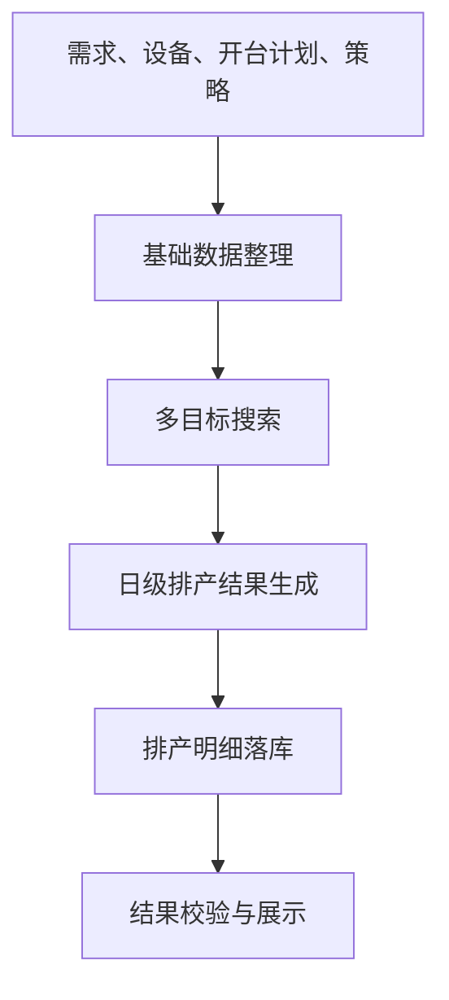

# 智能排产实现思路与逻辑

## 1. 文档目的

本文面向业务人员和管理层，说明当前智能排产的核心思路、决策逻辑和系统边界。不展开代码实现细节，而是回答三个问题：

- 系统依据什么信息做排产？
- 系统如何在多个目标之间做权衡？
- 系统最终为什么会得到这样的排产结果？

当前智能排产已经采用“一体化日级排产”思路，即系统直接生成“某一天、某台设备、生产某个牌号、生产多少”的结果，而不是先做粗分配、再做二次拆解。

## 2. 系统要解决的本质问题

智能排产本质上是在有限资源条件下，对计划量、设备、时间和切换成本做一次全局平衡。  
它不是简单回答“哪台设备能生产哪个牌号”，而是要同时回答：

- 在给定计划周期内，哪些牌号应当优先完成
- 每天最多允许开多少台设备
- 哪些设备应保持连续生产，避免频繁切换
- 当连续性、交期和负载之间发生冲突时，优先牺牲什么

因此，智能排产不是单点规则判断，而是一个多目标优化问题。

## 3. NSGA-II 算法在智能排产中的作用

当前智能排产并不是按固定规则一步一步顺推出来的，而是借助 NSGA-II 多目标遗传算法，在大量可行方案中不断筛选、淘汰和保留，最终找到一组综合效果更好的排产结果。

可以把它理解为：系统不是只生成一份方案，而是先生成很多份候选方案，再反复比较这些方案在“完成率、连续性、换牌、均衡性”等方面的表现，最后保留更优的一批。

### 3.1 为什么要用 NSGA-II

排产场景天然存在多目标冲突：

- 想尽快排完计划量，往往需要更多设备同时投入
- 想减少换牌，就会更倾向连续生产
- 想让设备负载均衡，又可能打散连续生产安排

如果只按单一目标排序，通常会顾此失彼。  
NSGA-II 的价值就在于：它不是只追求一个指标最优，而是在多个目标之间寻找更平衡的结果。

### 3.2 在当前系统里，算法优化的对象是什么

当前实现把“某一天的一台设备”作为一个基本决策单元。  
算法真正要决定的是：

> 这台设备在这一天是否开机；如果开机，生产哪个牌号。

因此，算法优化的不是简单的“设备归属关系”，而是直接面向日级排产结果本身。

### 3.3 算法如何工作

NSGA-II 在当前系统中的工作方式，可以概括成五步：

1. **初始化种群** ：先生成一批候选排产方案，其中既包含启发式方案，也包含随机方案。
   
2. **评估方案** ：对每一份方案计算多项指标，例如未完成量、换牌次数、连续生产效果、设备负载差异等。
   
3. **选择与繁殖** ：从当前较优方案中选择“父代”，通过交叉和变异生成新的“子代”方案。
   
4. **多目标比较** ：使用非支配排序和拥挤度机制，保留综合表现更好的方案，同时避免所有方案过早收缩到同一种风格。
   
5. **输出最优结果** ：当迭代达到设定次数后，从最优方案集合中挑出一份综合表现最好的结果，转成最终排产明细。

### 3.4 用一段简化代码理解算法主循环

下面这段示意代码，可以帮助理解它的运行方式：

```java
population = initializePopulation();
evaluate(population);

for (generation = 0; generation < maxGenerations; generation++) {
    parents = select(population);
    offspring = crossoverAndMutate(parents);
    evaluate(offspring);
    population = keepBetterSolutions(population, offspring);
}

best = chooseBestSolution(population);
```

这段代码背后的含义是：

- 先准备一批候选方案
- 不断生成新方案并淘汰较差方案
- 最终从多轮比较后留下的方案中选出最好的一份

所以，智能排产不是“拍脑袋随机排”，而是“生成很多方案、持续比较、逐步逼近更优结果”。

### 3.5 为什么它适合当前排产场景

从管理角度看，NSGA-II 适合当前排产场景，主要有三点原因：

- **能同时处理多个目标**：不需要在完成率、连续性、换牌和均衡性之间只选一个
- **适应约束复杂的场景**：可以把开台上限、禁止回切等业务规则一起纳入比较
- **结果可调**：当企业管理重心变化时，可以通过策略权重和优先级改变算法偏好

因此，NSGA-II 在这里并不是为了“算法先进”而使用，而是因为它确实更适合处理当前这种多目标、强约束、结果需要平衡的排产问题。

## 4. 排产输入与输出

### 4.1 主要输入

系统排产时主要依赖四类信息：

- **需求信息**：每个牌号还剩多少待排计划量、交期在哪里
- **资源信息**：每台设备能生产哪些牌号、对应能力是多少
- **时间信息**：每台设备在每天是否开台、可工作时长是多少
- **策略信息**：哪些约束必须满足，哪些目标需要优先优化

同时，系统还会参考历史排产结果，用于保持生产连续性，减少无意义换牌。

### 4.2 最终输出

输出结果是日级排产明细。每条结果至少表达四个核心事实：

- 生产日期
- 生产设备
- 生产牌号
- 计划产量

从业务视角看，这份结果就是“月度计划在日维度和机台维度上的具体展开”。

## 5. 排产策略界面如何影响排产结果

排产策略界面本质上是在定义智能排产的计算口径，主要决定三件事：先看谁、怎样算更优、哪些底线不能破。

### 5.1 基础信息区

基础信息区用于区分、维护和启用不同策略版本，例如偏重完成率、偏重连续性或偏重换牌控制。它不直接参与排产计算，但决定当前系统采用哪一套排产思想。

### 5.2 订单初排规则

订单初排规则决定系统先关注哪些任务。交货期、需求数量、存调比、上月连续性这类条件，本质上是在定义需求进入计算时的优先顺序，从而影响算法一开始更倾向保障哪些牌号。

### 5.3 任务优化规则

任务优化规则决定系统怎样判断结果更优。这里的核心参数是优先级和权重，前者决定先比较什么，后者决定重视程度。牌号连续性、换牌少、最少完成时间、生产均衡性等目标的不同组合，会直接改变排产结果的风格。

### 5.4 约束规则与共同作用

约束规则定义系统不能突破的边界，例如最大同时开台数、安排全部排产量、禁止回切已完成牌号。三类配置合在一起，形成完整的排产逻辑：订单初排规则决定起点，任务优化规则决定偏好，约束规则决定边界，最终排产结果就是这三者在当前需求、资源和时间条件下的综合体现。

## 6. 总体实现思路

当前实现分为三个层次：

1. **准备层**  
   汇总订单、设备能力、开台计划、历史排产、换牌时间等基础数据，形成可计算的输入。

2. **优化层**  
   将“日期-设备”视为基本决策单元，在全局范围内搜索更优组合，而不是逐个牌号顺序排。

3. **落地层**  
   把优化结果转换成排产明细，回写已排产量，并形成对业务可见的排程日历。



这套结构的意义在于：前端看到的是日级结果，算法内部优化的也是日级结果，二者口径一致。

## 7. 排产决策的核心逻辑

### 7.1 决策单元

当前系统不是以“牌号”为单一中心做推演，而是以“某天的一台设备”作为基本决策单元。  
这意味着系统每天都在回答一个更具体的问题：

> 这台设备今天是否应该开？如果开，应该生产哪个牌号，生产多少？

这样的建模方式，天然更适合控制“每天开台数”与“设备连续生产”。

```text
for each day:
    for each machine:
        if machine is available:
            decide what to produce today
```

### 7.2 先保连续，再补最优

系统在每天的排产决策中，优先延续昨天仍在生产、且今天还有需求的牌号。  
这样做的管理含义很明确：

- 尽量减少换牌
- 尽量减少短段生产
- 尽量避免为了局部均衡而打散连续生产

只有当延续当前牌号不能满足整体目标时，系统才会切换到新的牌号。

```text
if yesterday's material still has demand
   and this machine can still produce it:
    continue yesterday's material
else:
    switch to a better material for today
```

### 7.3 计划量不是平均分，而是按能力与剩余需求动态计算

系统不会简单把计划量平均分到设备上，而是综合考虑：

- 该设备当天可用工时
- 该设备对该牌号的生产能力
- 当前牌号还剩多少需求

因此，排产结果是“设备能力驱动”的，不是“数量均摊驱动”的。

```text
maximum output = work hours × machine capacity
remaining output = unfinished demand
today's planned quantity = smaller of the two
```

### 7.4 为什么不能只靠人工规则顺排

如果只按人工经验顺排，通常容易出现三类问题：

- 局部看合理，但整体产量完成率不足
- 某些设备频繁切换，现场执行成本高
- 某些日期开台过多或过少，生产组织不稳定

智能排产的价值，就在于把这些彼此冲突的因素放到同一个框架里统一衡量，而不是逐条规则各自为战。

```text
overall score =
    completion impact
  + changeover impact
  + balance impact

keep the solution with the lower total score
```

## 8. 约束与优化目标

### 8.1 硬约束

硬约束代表“不能轻易突破的底线”。当前主要包括：

- **每天最多开台数**：限制同一天同时投入的设备数量
- **计划量完成要求**：在策略要求下，未完成量会被视为严重劣解
- **禁止回切旧牌号**：设备切走某牌号后，不应反复回切

这些约束的意义不是让排产绝对僵化，而是防止结果偏离现场管理原则。

```text
if opened machines exceed the daily limit:
    reject this solution
if demand must be fully completed but there is still remainder:
    reject this solution
if returning to a finished material is forbidden:
    reject this solution
```

### 8.2 优化目标

在满足基本约束的前提下，系统会继续优化三类问题：

- **连续性**：同一牌号尽量连续生产，减少碎片化
- **换牌成本**：尽量减少设备切换次数和切换时长
- **负载均衡**：尽量避免部分设备过满、部分设备过空

这三者之间没有绝对同时最优，系统的本质是在优先级和权重约束下寻找“整体更合理”的平衡点。

```text
objective value =
    continuity penalty × weight
  + changeover penalty × weight
  + balance penalty × weight
```

### 8.3 硬约束和优化目标的区别

二者的区别可以用一句话概括：

- **硬约束** 解决“能不能这样排”
- **优化目标** 解决“在可行前提下，怎样排更好”

例如，“每天最多开多少台设备”属于底线问题；  
而“尽量少换牌、尽量连续生产”属于质量问题。  
系统会先守住底线，再在底线之上比较不同方案的优劣。

```text
if hard constraints are satisfied:
    compare solution quality
else:
    remove this solution
```

## 9. 为什么采用多目标优化

排产问题最大的难点在于：很多目标天然互相冲突。

例如：

- 想减少换牌，通常意味着更强调连续生产
- 想更快完成全部计划量，可能需要更多设备同时开台
- 想让负载更均衡，往往会打散部分原本连续的生产安排

如果只靠固定规则逐条判断，容易在局部看起来合理，但整体效果不稳定。  
因此当前实现采用多目标优化方法，本质上是在多种可行方案中比较“综合代价”，选出整体最优的结果，而不是追求单一指标极致。

```text
compare all feasible solutions together
first look at completion
then look at changeover cost
then look at balance
keep the overall better one
```

## 10. 如何理解最终排产结果及其管理价值

对于业务和管理层来说，最终结果不需要从算法角度阅读，而可以从三个问题来判断是否合理：

### 10.1 计划有没有尽量完成

首先看的是计划完成程度。  
如果计划量大面积未排完，其他优化都没有意义。

```text
completion rate =
    completed quantity ÷ required quantity
the closer to full completion, the better
```

### 10.2 现场执行会不会过于折腾

其次看的是执行稳定性，包括：

- 某一天是否开台过多
- 同一设备是否频繁换牌
- 同一牌号是否被切得过碎

如果结果虽然完成量高，但现场切换频繁、组织成本过高，也不能视为优质方案。

```text
stability depends on:
    how often machines switch
    whether one material is cut into too many short segments
the fewer disruptions, the better
```

### 10.3 资源利用是否均衡

最后看的是资源使用是否健康。  
如果部分设备长期满负荷、部分设备长期空闲，短期可能完成了计划，但长期运行会带来效率和管理问题。

```text
compare the load of all machines
if the gap is too large:
    the schedule is less balanced
```

因此，一份“好的排产结果”不是单看某一项指标，而是看完成率、执行稳定性和资源均衡是否同时处于合理区间。

从管理视角看，这样的结果判断方式，也对应着当前方案的三点价值：

### 10.4 排产结果更接近实际执行

系统输出直接就是日级排产结果，减少了中间理解和人工转换成本。

```text
output one daily record:
    date
    machine
    material
    planned quantity
```

### 10.5 现场约束能够进入统一模型

过去很多现场规则只能靠人工经验补充，现在已经可以把“开台上限、连续生产、换牌控制”等要求放到同一套排产逻辑里统一考虑。

```text
put demand, capacity, calendar and strategy
into the same calculation process
then validate the result against hard constraints
```

### 10.6 策略可调

不同阶段管理关注点不同。  
有的时期优先保交付，有的时期优先压换牌，有的时期更重视资源均衡。  
当前方案允许通过策略配置调整排产偏好，而不必每次都改核心逻辑。

```text
if management wants fewer changeovers:
    raise the changeover weight
if management wants more continuity:
    raise the continuity priority
```

## 11. 当前边界与认知提示

这套智能排产已经具备较强的业务适配能力，但仍需明确几个边界：

- 它依赖基础数据质量，尤其是设备能力、开台计划、换牌时间和计划量准确性
- 它输出的是“当前约束与权重下的最优解”，不是绝对唯一解
- 当目标之间冲突较强时，结果会明显受策略配置影响
- 它能够减少人工试排成本，但不替代现场管理判断

因此，智能排产更适合被理解为“高质量辅助决策系统”，而不是完全脱离业务管理的自动黑盒。

## 12. 总结

当前智能排产的核心思想可以概括为一句话：

> 以日级设备资源为决策单元，在满足关键管理约束的前提下，对计划完成、连续生产、换牌成本和资源均衡做全局综合优化。

它的价值不在于把排产过程变得更复杂，而在于把原本分散在人经验中的权衡逻辑，逐步转化为可配置、可复用、可解释的系统能力。
